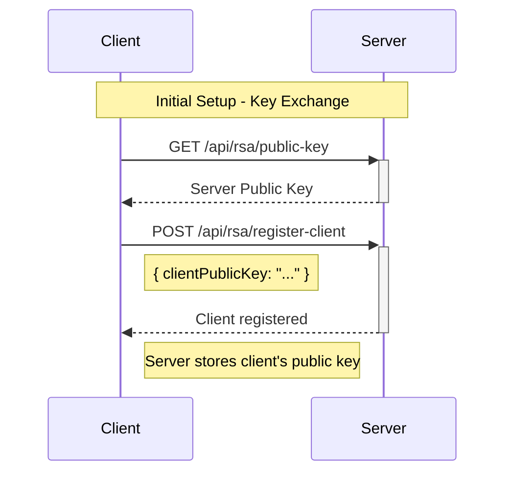
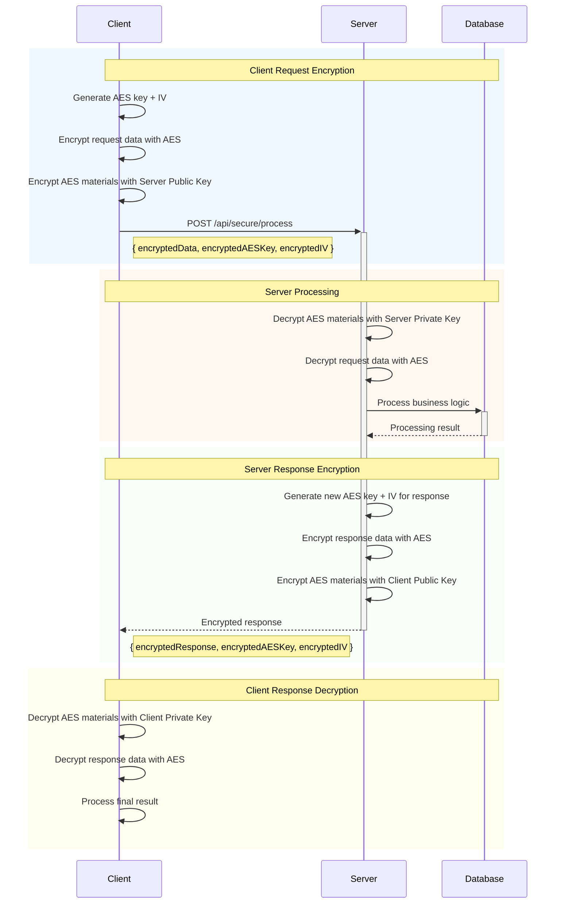

# 🔒 Realistic Client-Server Hybrid Encryption Flow

Tài liệu này mô tả luồng thực tế: **Client mã hóa → Server giải mã & xử lý → Server mã hóa response → Client giải mã**

## 🎯 Luồng thực tế so với Demo

### ❌ Demo Flow (Không an toàn)
```
Client ---(plaintext)---> Server ---(encrypt)---> Response
```

### ✅ Realistic Flow (An toàn)
```
Client ---(encrypt)---> Server ---(decrypt + process + encrypt)---> Client ---(decrypt)---
```

## 🔄 Chi tiết luồng thực tế

### Phase 1: Key Exchange & Setup



### Phase 2: Secure Request Flow



## 💻 Implementation Example

### 1. Server-side API Endpoint

```javascript
// POST /api/secure/process - Xử lý request đã mã hóa
app.post('/api/secure/process', async (req, res) => {
  try {
    const { encryptedData, encryptedAESKey, encryptedIV, clientId } = req.body;
    
    // === DECRYPT REQUEST ===
    // Giải mã AES materials bằng server private key
    const aesKey = serverRSA.decrypt(encryptedAESKey, 'utf8');
    const iv = serverRSA.decrypt(encryptedIV, 'utf8');
    
    // Giải mã request data bằng AES
    const requestData = decryptAES(encryptedData, aesKey, iv);
    console.log('✅ Request decrypted:', requestData);
    
    // === BUSINESS LOGIC ===
    const processedResult = await processBusinessLogic(requestData);
    
    // === ENCRYPT RESPONSE ===
    // Lấy public key của client
    const clientPublicKey = getClientPublicKey(clientId);
    
    // Tạo AES materials mới cho response
    const responseAESKey = crypto.randomBytes(32);
    const responseIV = crypto.randomBytes(16);
    
    // Mã hóa response data bằng AES
    const encryptedResponse = encryptAES(
      JSON.stringify(processedResult), 
      responseAESKey, 
      responseIV
    );
    
    // Mã hóa AES materials bằng client public key
    const clientRSA = new NodeRSA(clientPublicKey);
    const encryptedResponseAESKey = clientRSA.encrypt(responseAESKey.toString('hex'), 'base64');
    const encryptedResponseIV = clientRSA.encrypt(responseIV.toString('hex'), 'base64');
    
    res.json({
      success: true,
      encryptedResponse: encryptedResponse,
      encryptedAESKey: encryptedResponseAESKey,
      encryptedIV: encryptedResponseIV,
      message: 'Request processed securely'
    });
    
  } catch (error) {
    res.status(500).json({
      success: false,
      error: 'Secure processing failed: ' + error.message
    });
  }
});
```

### 2. Client-side Implementation

```javascript
class SecureAPIClient {
  constructor(serverURL, clientPrivateKey, serverPublicKey) {
    this.serverURL = serverURL;
    this.clientPrivateKey = clientPrivateKey;
    this.serverPublicKey = serverPublicKey;
    this.clientId = 'client_' + Date.now(); // Unique client identifier
  }
  
  /**
   * Gửi request đã mã hóa lên server
   */
  async secureRequest(endpoint, data) {
    try {
      // === ENCRYPT REQUEST ===
      console.log('🔐 Encrypting request data...');
      
      // Tạo AES materials cho request
      const aesKey = crypto.randomBytes(32);
      const iv = crypto.randomBytes(16);
      
      // Mã hóa request data bằng AES
      const encryptedData = this.encryptAES(JSON.stringify(data), aesKey, iv);
      
      // Mã hóa AES materials bằng server public key
      const serverRSA = new NodeRSA(this.serverPublicKey);
      const encryptedAESKey = serverRSA.encrypt(aesKey.toString('hex'), 'base64');
      const encryptedIV = serverRSA.encrypt(iv.toString('hex'), 'base64');
      
      // === SEND ENCRYPTED REQUEST ===
      console.log('📤 Sending encrypted request...');
      const response = await axios.post(`${this.serverURL}${endpoint}`, {
        encryptedData,
        encryptedAESKey,
        encryptedIV,
        clientId: this.clientId
      });
      
      // === DECRYPT RESPONSE ===
      console.log('🔓 Decrypting response...');
      const { encryptedResponse, encryptedAESKey: respAESKey, encryptedIV: respIV } = response.data;
      
      // Giải mã AES materials bằng client private key
      const clientRSA = new NodeRSA(this.clientPrivateKey);
      const responseAESKey = clientRSA.decrypt(respAESKey, 'utf8');
      const responseIV = clientRSA.decrypt(respIV, 'utf8');
      
      // Giải mã response data bằng AES
      const decryptedResponse = this.decryptAES(
        encryptedResponse, 
        Buffer.from(responseAESKey, 'hex'), 
        Buffer.from(responseIV, 'hex')
      );
      
      console.log('✅ Response decrypted successfully');
      return JSON.parse(decryptedResponse);
      
    } catch (error) {
      console.error('❌ Secure request failed:', error.message);
      throw error;
    }
  }
  
  encryptAES(text, key, iv) {
    const cipher = crypto.createCipheriv('aes-256-cbc', key, iv);
    let encrypted = cipher.update(text, 'utf8', 'hex');
    encrypted += cipher.final('hex');
    return encrypted;
  }
  
  decryptAES(encryptedText, key, iv) {
    const decipher = crypto.createDecipheriv('aes-256-cbc', key, iv);
    let decrypted = decipher.update(encryptedText, 'hex', 'utf8');
    decrypted += decipher.final('utf8');
    return decrypted;
  }
}
```

### 3. Usage Example

```javascript
async function realisticFlowExample() {
  try {
    // === SETUP ===
    console.log('🔧 Setting up secure client...');
    
    // Lấy server public key
    const serverKeyResponse = await axios.get('http://localhost:3000/api/rsa/public-key');
    const serverPublicKey = serverKeyResponse.data.publicKey;
    
    // Tạo client keypair
    const clientKeyResponse = await axios.get('http://localhost:3000/api/rsa/generate-keypair');
    const { publicKey: clientPublicKey, privateKey: clientPrivateKey } = clientKeyResponse.data;
    
    // Khởi tạo secure client
    const secureClient = new SecureAPIClient(
      'http://localhost:3000',
      clientPrivateKey,
      serverPublicKey
    );
    
    // Register client với server
    await axios.post('http://localhost:3000/api/rsa/register-client', {
      clientId: secureClient.clientId,
      clientPublicKey: clientPublicKey
    });
    
    // === SECURE COMMUNICATION ===
    console.log('💬 Starting secure communication...');
    
    const sensitiveData = {
      action: 'transfer_money',
      from_account: '1234567890',
      to_account: '9876543210',
      amount: 50000,
      currency: 'USD',
      description: 'Business payment - confidential transaction'
    };
    
    console.log('📋 Original data:', sensitiveData);
    
    // Gửi request đã mã hóa
    const result = await secureClient.secureRequest('/api/secure/process', sensitiveData);
    
    console.log('✅ Processed result:', result);
    
  } catch (error) {
    console.error('❌ Realistic flow failed:', error.message);
  }
}
```

## 🔐 Security Benefits

### End-to-End Encryption
- ✅ Data được mã hóa từ client trước khi gửi
- ✅ Server không bao giờ thấy plaintext trong network
- ✅ Response được mã hóa trước khi gửi về client

### Key Isolation  
- ✅ Mỗi request/response có AES key riêng
- ✅ AES key chỉ tồn tại trong memory ngắn hạn
- ✅ RSA key được quản lý độc lập

### Perfect Forward Secrecy
- ✅ Compromise một session không ảnh hưởng session khác
- ✅ AES key được generate random mỗi lần

## 📊 So sánh với Demo Flow

| Aspect | Demo Flow | Realistic Flow |
|--------|-----------|----------------|
| **Client Encryption** | ❌ Không có | ✅ Có |
| **Network Security** | ❌ Plaintext trên network | ✅ Encrypted trên network |
| **Server Processing** | ❌ Chỉ mã hóa demo | ✅ Decrypt + Process + Encrypt |
| **Response Security** | ❌ Response không encrypted | ✅ Response được encrypted |
| **Key Management** | ❌ Server key only | ✅ Client + Server keys |
| **Real-world Ready** | ❌ Demo only | ✅ Production ready |

## 🚀 Implementation Steps

1. **Tạo SecureAPIClient class** - Handle client-side encryption
2. **Tạo /api/secure/process endpoint** - Handle encrypted requests  
3. **Implement key registration** - Quản lý client public keys
4. **Add request validation** - Validate encrypted payloads
5. **Error handling** - Handle crypto failures gracefully
6. **Logging & monitoring** - Track secure transactions

## 🔗 Next Steps

- Implement trong folder `2_Flow_API`
- Tạo working examples với real business logic
- Add authentication layer
- Implement key rotation mechanism
- Add performance optimization
